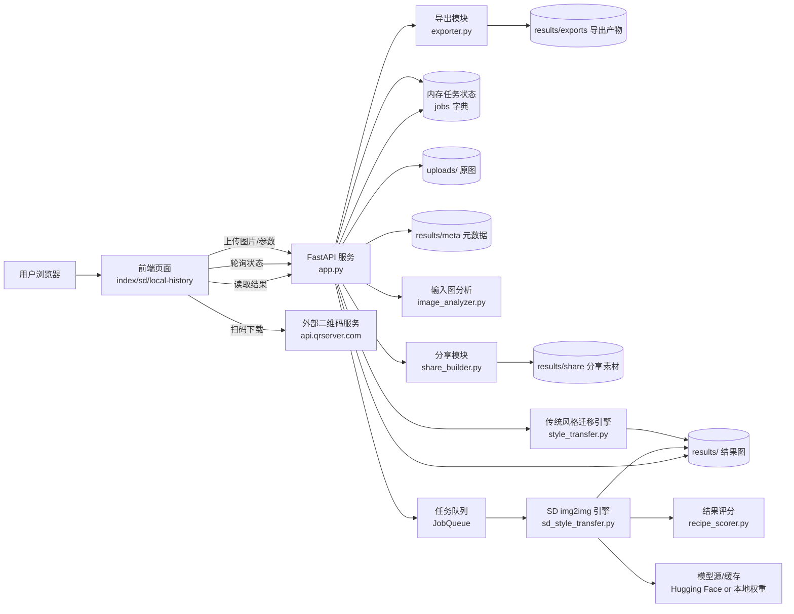
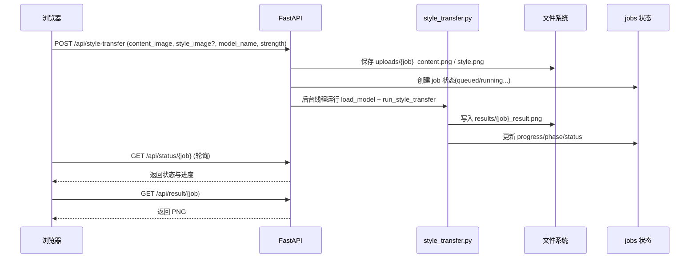
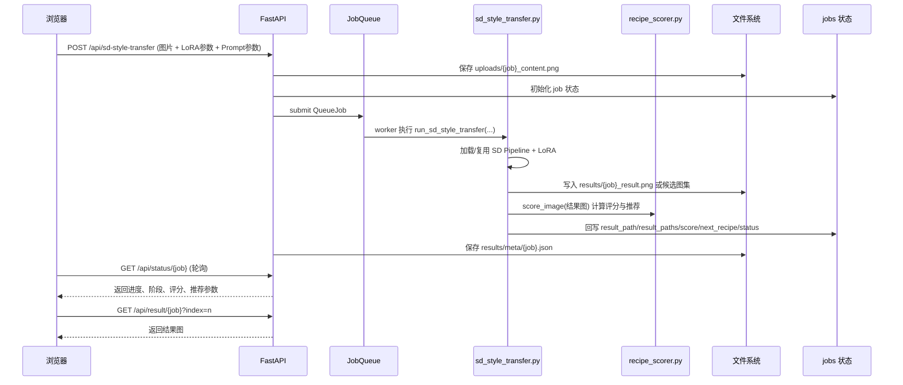
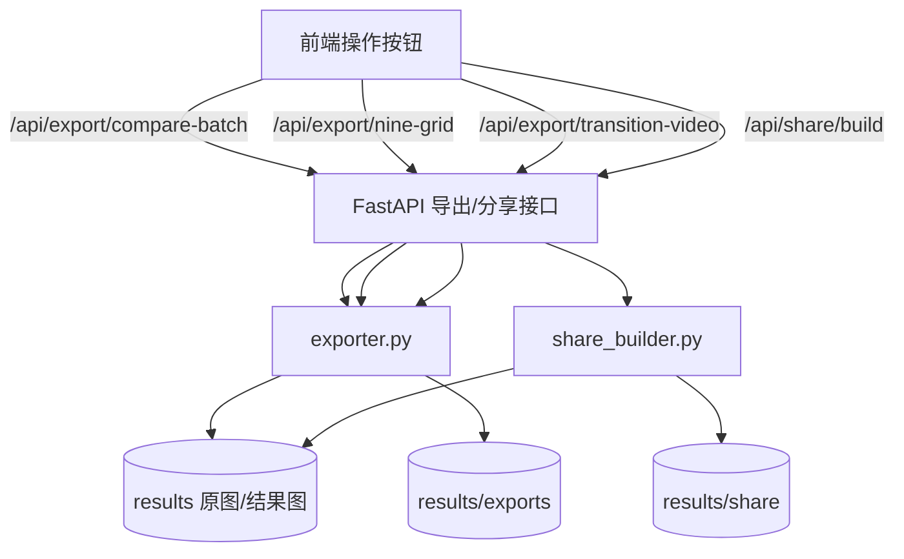

# 项目数据流图

本文基于当前项目代码（FastAPI + 前端 JS + 本地文件存储 + 模型推理）整理。

## 1) 系统总览数据流

## 2) 核心流程 A：传统风格迁移 `/api/style-transfer`

## 3) 核心流程 B：SD 风格迁移 `/api/sd-style-transfer`

## 4) 核心流程 C：导出与分享

## 5) 数据存储与状态边界

- **短期状态**：`jobs` 与 `JobQueue._jobs` 在内存中；服务重启后会丢失。
- **持久化文件**：上传图、结果图、meta、导出图/视频、分享卡片保存在磁盘目录。
- **恢复能力**：`/api/result/{job_id}`、`/api/original/{job_id}` 会优先走磁盘路径，部分能力可跨重启继续访问。
- **外部依赖点**：
  - 二维码生成走公网接口 `api.qrserver.com`（前端直接调用）。
  - SD 基础模型可走本地权重，或在允许下载时走 Hugging Face。

