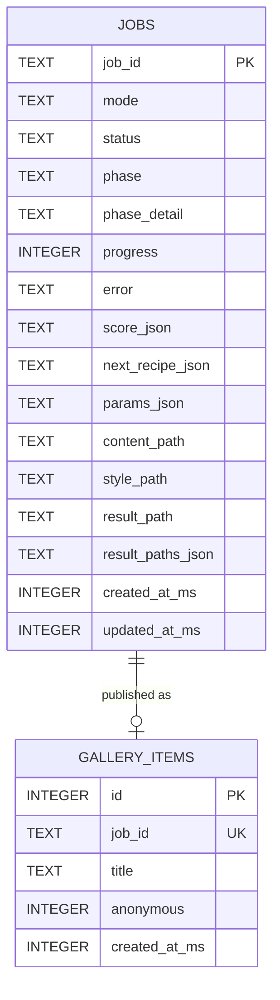
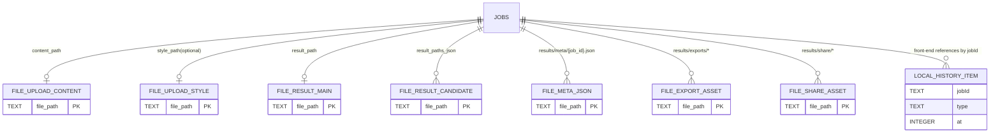

# 数据模型 ER 图

本项目的持久化核心在 `data/jobs.db`（SQLite），其中真正的关系型实体是：

- `jobs`
- `gallery_items`

此外还有两类“非关系持久化”：

- 文件系统资产（`uploads/`、`results/`）
- 浏览器本地记录（`localStorage`）

---

## 1) 核心关系模型（SQLite）

说明：

- `jobs.job_id` 是业务主键（UUID 字符串）。
- `gallery_items.job_id` 是唯一键（每个任务最多发布一次到画廊），通过应用层 `LEFT JOIN jobs ON jobs.job_id = gallery_items.job_id` 建立关联。
- `score_json / next_recipe_json / params_json / result_paths_json` 是 JSON 文本列，用于承载可变结构。

---

## 2) 扩展数据域（文件资产 + 前端本地记录）

说明：

- 这一层是“逻辑 ER”，用于表达系统真实数据流，不是 SQLite 物理表。
- `LOCAL_HISTORY_ITEM` 来自浏览器 `localStorage`（`models_local_history_v1`），不在后端 DB 中。

---

## 3) 设计约束与建议

- 当前 `gallery_items` 未声明外键约束（SQLite 物理层），是“软关联”。
- 若要增强一致性，可加：
  - `gallery_items.job_id` 外键到 `jobs.job_id`
  - 删除策略（`ON DELETE CASCADE` 或限制删除）
- JSON 字段若后续查询变多，建议把高频筛选项（如 `sd_style_name`、`total_score`）冗余为独立列并建索引。

