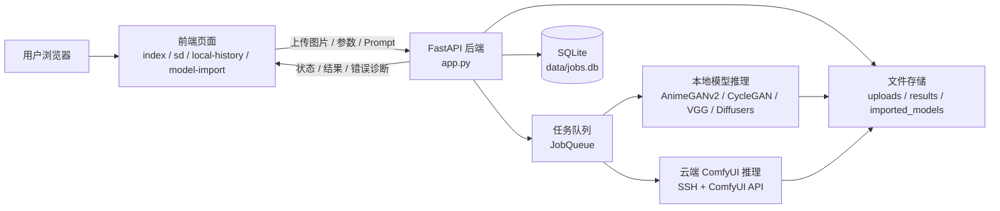
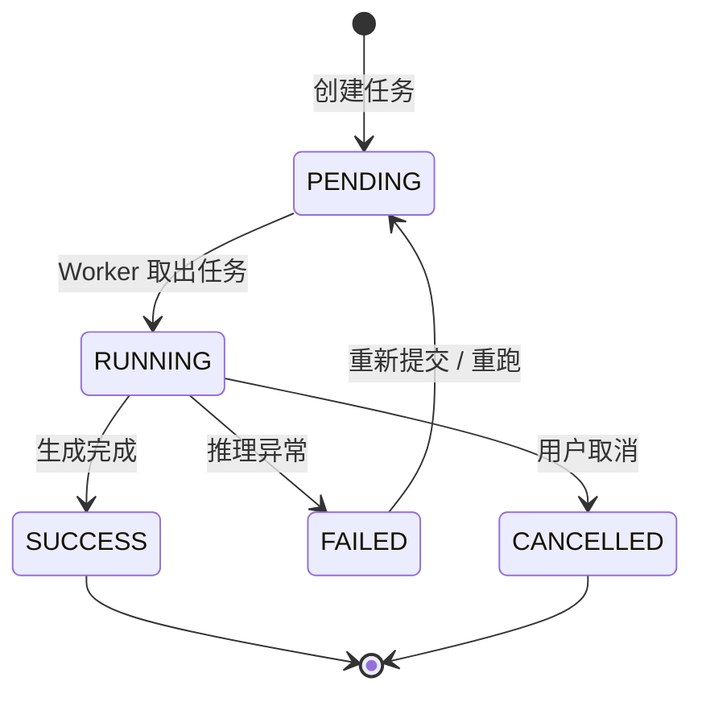
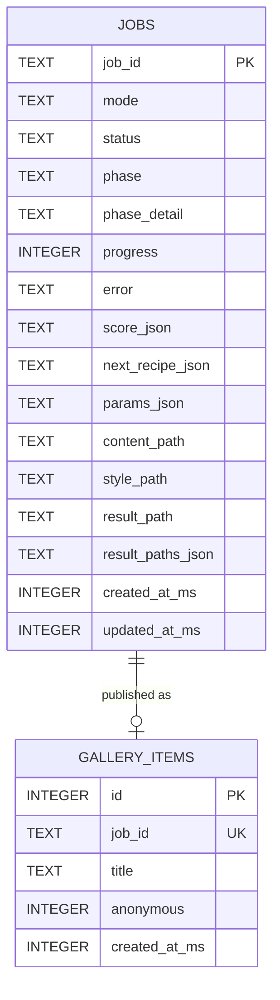

# 灵境画炉 / AetherCanvas

基于深度学习的图像风格迁移与智能重绘工作站。项目将传统图像风格迁移模型、Stable Diffusion 图生图、LoRA 风格模型、模型导入管理、本地历史记录和云端 ComfyUI 推理整合到一个 Web 应用中，适合课程设计、毕业设计展示和个人 AI 图像创作实验。

## 项目简介

本系统面向“上传图片后快速获得不同艺术风格结果”的使用场景，提供两条主要生成路线：

- **风格迁移**：使用 AnimeGANv2、CycleGAN、VGG 等传统风格迁移模型，对图片进行动漫化、油画化、浮世绘、水墨等转换。
- **SD 智能重绘**：使用 Stable Diffusion / SDXL / LoRA 对输入图片进行图生图重绘，支持提示词、重绘强度、采样步数、CFG、基础模型和 LoRA 组合配置。

系统采用 Browser/Server 架构，后端使用 FastAPI 管理任务、模型、文件和云端推理，前端使用 HTML、Tailwind CSS 和 JavaScript 实现交互页面。

## 技术栈

### 后端

- Python 3.10+
- FastAPI
- Uvicorn
- Jinja2
- Pillow / OpenCV / NumPy
- SQLite
- Paramiko

### AI 与图像生成

- PyTorch
- ONNX Runtime GPU
- Diffusers
- Transformers
- Accelerate
- Safetensors
- PEFT
- Stable Diffusion 1.5
- SDXL / Illustrious / Animagine 等基础模型
- LoRA 风格模型
- ComfyUI 云端工作流

### 前端

- HTML
- Tailwind CSS
- JavaScript
- Fetch API
- Canvas 动画
- LocalStorage 本地历史记录

### 数据与文件

- `uploads/`：用户上传图片
- `results/`：生成结果
- `results/meta/`：任务元数据
- `results/exports/`：导出产物
- `data/jobs.db`：任务记录数据库
- `config/sd_styles.json`：SD 风格、基础模型、LoRA 绑定配置

## 功能说明

### 1. 风格迁移页面

入口：`/`

主要功能：

- 上传内容图
- 上传可选风格图
- 选择传统风格迁移模型
- 调整风格强度
- 执行风格迁移
- 查看生成结果
- 下载结果图
- 保存到本地历史记录

支持模型类型：

- AnimeGANv2
- CycleGAN
- VGG 风格迁移
- ONNX 动漫化模型

### 2. SD 智能重绘页面

入口：`/sd`

主要功能：

- 上传内容图
- 选择 SD 风格
- 选择基础模型
- 自动匹配 LoRA 绑定基础模型
- 设置正向提示词
- 设置负向提示词
- 调整重绘强度
- 调整采样步数
- 调整 CFG 强度
- 查看实时生成进度
- 下载生成结果
- 写入历史记录

适用场景：

- 图片动漫化重绘
- 像素风转换
- 水彩 / 水墨风格
- JOJO 漫画风格
- SDXL 大模型重绘
- LoRA 细分风格创作

### 3. 模型导入与管理

入口：`/model-import`

主要功能：

- 查看已配置风格模型
- 查看已配置 SD 基础模型
- 查看已配置 LoRA
- 导入新模型
- 将模型上传到云端
- 管理模型启用状态

支持的模型类型：

- `.safetensors`
- `.ckpt`
- `.pth`
- `.onnx`
- Diffusers 目录模型

说明：

- 基础模型用于决定生成能力和模型体系，例如 SD1.5、SDXL、Illustrious。
- LoRA 用于控制具体风格，例如水彩、像素、漫画、角色风格。
- 不同 LoRA 通常需要匹配对应基础模型，系统支持在配置中绑定推荐基础模型，避免每次手动切换。

### 4. 本地历史记录

入口：`/local-history`

主要功能：

- 查看最近生成结果
- 区分风格迁移和 SD 重绘结果
- 按时间展示历史记录
- 点击查看图片
- 支持生态风格 UI
- 支持天气状态挂件与页面动效

历史数据主要保存在浏览器本地，同时后端任务记录保存在 SQLite 中。

### 5. 云端 ComfyUI 接入

入口：

- `/cloud-settings`
- `/cloud-upload-monitor`

主要功能：

- 配置远端 SSH 信息
- 检测云端 GPU 状态
- 检测 ComfyUI 是否运行
- 上传本地模型到云端
- 同步远端 checkpoint 和 LoRA
- 将前端风格映射到云端模型文件
- 使用云端 GPU 执行 SD 图生图任务

适用场景：

- 本地没有高性能显卡
- SDXL 本地推理太慢
- 需要使用 RTX 4090 等云端 GPU
- 需要避免大模型占用本地显存

## 项目结构

```text
.
├── app.py                         # FastAPI 主入口
├── style_transfer.py              # 传统风格迁移
├── sd_style_transfer.py           # Stable Diffusion 本地推理
├── cloud_comfyui.py               # 云端 ComfyUI 推理
├── job_queue.py                   # 任务队列
├── job_store.py                   # SQLite 任务持久化
├── image_analyzer.py              # 输入图像分析
├── recipe_scorer.py               # 结果评分与参数推荐
├── exporter.py                    # 结果导出
├── share_builder.py               # 分享卡片生成
├── config/
│   └── sd_styles.json             # SD 风格与模型配置
├── templates/
│   ├── index.html                 # 风格迁移页面
│   ├── sd.html                    # SD 重绘页面
│   ├── model_import.html          # 模型管理页面
│   ├── local_history.html         # 本地历史记录页面
│   ├── cloud_settings.html        # 云端配置页面
│   └── cloud_upload_monitor.html  # 云端上传监控页面
├── static/
│   ├── main.js                    # 风格迁移前端逻辑
│   ├── sd.js                      # SD 页面前端逻辑
│   ├── history_page.js            # 历史记录页面逻辑
│   └── local_history.css          # 历史记录页面独立样式
├── uploads/                       # 上传图片目录，运行时生成
├── results/                       # 生成结果目录，运行时生成
├── imported_models/               # 导入模型目录，本地使用
└── data/                          # 数据库与本地私有配置
```

## 安装与运行

### 1. 克隆项目

```bash
git clone https://github.com/lgcr12/image-style-transfer-system-.git
cd image-style-transfer-system-
```

### 2. 创建虚拟环境

Windows:

```powershell
python -m venv .venv
.\.venv\Scripts\activate
```

macOS / Linux:

```bash
python -m venv .venv
source .venv/bin/activate
```

### 3. 安装依赖

```bash
pip install -r requirements.txt
```

如果需要 GPU 推理，请根据本机 CUDA 版本安装对应的 PyTorch 和 ONNX Runtime GPU 版本。

### 4. 启动服务

```bash
python -m uvicorn app:app --host 127.0.0.1 --port 8001
```

也可以使用一键启动脚本：

Windows:

```powershell
.\run.bat
```

macOS / Linux:

```bash
chmod +x run.sh
./run.sh
```

脚本会自动创建虚拟环境、安装依赖并在 `http://127.0.0.1:8001` 启动服务。

浏览器访问：

```text
http://127.0.0.1:8001/
```

常用页面：

```text
http://127.0.0.1:8001/                  风格迁移
http://127.0.0.1:8001/sd                SD 智能重绘
http://127.0.0.1:8001/model-import      模型导入
http://127.0.0.1:8001/local-history     本地历史
http://127.0.0.1:8001/cloud-settings    云端配置
```

## 模型准备

项目不会提交大模型权重，需要用户自行准备模型文件。

推荐目录：

```text
E:/models/
├── v1-5-pruned-emaonly.safetensors
├── MeinaMixV12.safetensors
├── imported_models/
│   ├── Illustrious-XL-v2.0.safetensors
│   └── *.safetensors
```

模型配置文件：

```text
config/sd_styles.json
```

基础模型配置示例：

```json
{
  "base_models": {
    "sd15": {
      "label": "SD 1.5",
      "type": "single_file",
      "model_type": "sd15",
      "path": "E:/models/v1-5-pruned-emaonly.safetensors"
    }
  }
}
```

LoRA 风格绑定示例：

```json
{
  "styles": {
    "pixel_style": {
      "label": "像素风",
      "adapters": ["pixel_lora"],
      "weights": [0.8],
      "base_model": "sd15"
    }
  }
}
```

## 云端 GPU 使用方法

### 1. 准备云端环境

云端需要具备：

- Linux 实例
- NVIDIA GPU
- 可 SSH 登录
- Python / Conda
- ComfyUI
- ComfyUI 默认端口 `8188`

推荐远端目录结构：

```text
/root/autodl-tmp/ComfyUI/
├── main.py
├── models/
│   ├── checkpoints/
│   └── loras/
├── input/
└── output/
```

### 2. 配置云端连接

进入：

```text
http://127.0.0.1:8001/cloud-settings
```

填写：

- Host
- Port
- Username
- Password
- ComfyUI Root

敏感信息会写入本地私有配置：

```text
data/cloud_upload_config.local.json
```

该文件已加入 `.gitignore`，不会上传到 GitHub。

### 3. 上传模型

进入：

```text
http://127.0.0.1:8001/model-import
```

点击对应模型的“上传云端”按钮，系统会进入上传监控页面：

```text
http://127.0.0.1:8001/cloud-upload-monitor
```

### 4. 运行云端生成

云端生成前需要确认：

- SSH 正常
- GPU 可用
- ComfyUI 可访问
- 选择的 checkpoint 已上传
- 选择的 LoRA 已上传
- 映射文件中的模型名与 ComfyUI `object_info` 列表一致

如果云端实例是无卡模式，会出现：

```text
No devices were found
```

需要先在云平台切回 GPU 模式。

## 系统架构设计

系统采用典型的 Browser/Server 架构，前端负责交互和状态展示，后端负责任务调度、模型推理、文件管理和云端 ComfyUI 调用。整体链路如下：



核心设计点：

- 前端页面不直接执行模型推理，只负责提交任务、轮询状态和展示结果。
- 后端收到请求后创建 `job_id`，将任务写入状态表和任务队列。
- 图片生成属于耗时任务，不能同步阻塞 HTTP 请求，因此使用后台任务队列执行。
- 生成过程中的状态、进度、错误信息会持续更新，前端通过 `/api/status/{job_id}` 轮询。
- 结果文件统一保存到 `results/`，上传文件保存到 `uploads/`，模型文件保存到 `imported_models/` 或用户指定目录。
- 云端推理通过 SSH 上传输入图和模型文件，通过 ComfyUI API 提交工作流并下载结果。

## 任务状态流转

图片生成任务使用统一状态管理，便于前端展示进度、后端恢复任务和定位异常。



状态说明：

| 状态 | 含义 | 前端表现 |
|---|---|---|
| `PENDING` / `queued` | 任务已创建，等待执行 | 显示排队中 |
| `RUNNING` / `running` | 模型正在推理 | 显示进度条和阶段文案 |
| `SUCCESS` / `done` | 生成完成 | 显示结果图和下载按钮 |
| `FAILED` / `error` | 生成失败 | 显示错误原因和处理建议 |
| `CANCELLED` | 用户取消任务 | 停止轮询并恢复按钮状态 |

每个任务至少包含：

- `job_id`
- `mode`
- `status`
- `phase`
- `phase_detail`
- `progress`
- `content_path`
- `result_path`
- `params_json`
- `error`
- `created_at_ms`
- `updated_at_ms`

## 接口文档

### POST `/api/style-transfer`

用途：提交传统风格迁移任务。

请求参数：

| 参数 | 类型 | 必填 | 说明 |
|---|---|---|---|
| `content_image` | File | 是 | 内容图 |
| `style_image` | File | 否 | 风格图，部分模型需要 |
| `model_name` | string | 是 | 风格迁移模型名称 |
| `strength` | float | 否 | 风格强度 |

返回示例：

```json
{
  "job_id": "uuid",
  "status": "running"
}
```

失败情况：

- 未上传图片
- 图片格式不支持
- 模型文件不存在
- 推理过程异常

### POST `/api/sd-style-transfer`

用途：提交 Stable Diffusion 图生图重绘任务。部分文档中也可称为 SD Generate，对应本项目实际接口为 `/api/sd-style-transfer`。

请求参数：

| 参数 | 类型 | 必填 | 说明 |
|---|---|---|---|
| `content_image` | File | 是 | 输入内容图 |
| `sd_style_name` | string | 是 | SD 风格 / LoRA 风格 |
| `base_model` | string | 否 | 基础模型 key |
| `prompt` | string | 否 | 正向提示词 |
| `negative_prompt` | string | 否 | 负向提示词 |
| `denoising_strength` | float | 否 | 重绘强度 |
| `num_inference_steps` | int | 否 | 采样步数 |
| `guidance_scale` | float | 否 | CFG 强度 |
| `use_cloud` | bool | 否 | 是否使用云端 ComfyUI |

返回示例：

```json
{
  "job_id": "uuid",
  "status": "queued",
  "mode": "sd"
}
```

失败情况：

- 输入图片缺失
- 基础模型不存在
- LoRA 与基础模型不兼容
- GPU 显存不足
- 云端 ComfyUI 不可访问

### GET `/api/status/{job_id}`

用途：查询任务状态和进度。

返回字段：

| 字段 | 说明 |
|---|---|
| `status` | 任务状态 |
| `progress` | 进度百分比 |
| `phase` | 当前阶段 |
| `phase_detail` | 阶段说明 |
| `has_result` | 是否已有结果 |
| `diagnosis` | 错误诊断信息 |

返回示例：

```json
{
  "status": "running",
  "progress": 55,
  "phase": "generating",
  "phase_detail": "云端 ComfyUI 生成中",
  "has_result": false
}
```

### GET `/api/result/{job_id}`

用途：获取生成结果图。

参数：

| 参数 | 类型 | 必填 | 说明 |
|---|---|---|---|
| `index` | int | 否 | 多候选图下的结果序号 |

失败情况：

- job_id 不存在
- 任务尚未完成
- 结果文件不存在

### POST `/api/model-import/sd-lora`

用途：导入 SD LoRA 模型。

请求参数：

| 参数 | 类型 | 必填 | 说明 |
|---|---|---|---|
| `file` | File | 是 | LoRA 文件 |
| `key` | string | 是 | 模型唯一 key |
| `label` | string | 是 | 页面显示名称 |
| `base_model` | string | 否 | 推荐基础模型 |

失败情况：

- 文件格式不支持
- key 重复
- 文件保存失败

### POST `/api/model-import/sd-base`

用途：导入 SD 基础模型。

请求参数：

| 参数 | 类型 | 必填 | 说明 |
|---|---|---|---|
| `file` | File | 是 | checkpoint 或 safetensors |
| `key` | string | 是 | 基础模型 key |
| `label` | string | 是 | 页面显示名称 |
| `model_type` | string | 是 | `sd15` 或 `sdxl` |

### GET `/api/history`

用途：查询任务历史记录。

返回内容：

- `job_id`
- `mode`
- `status`
- `result_path`
- `created_at_ms`
- `params`

## 数据库设计

系统核心持久化数据位于 `data/jobs.db`。当前主要表为 `jobs` 和 `gallery_items`。



数据库设计说明：

- `jobs` 保存任务全生命周期状态。
- `params_json` 保存模型、提示词、重绘强度、CFG 等可变参数。
- `result_path` 保存主结果图路径。
- `result_paths_json` 支持多候选结果。
- `score_json` 和 `next_recipe_json` 用于结果评分和参数推荐。
- 图片文件不直接写入数据库，而是保存到文件系统，数据库只保存路径。

## 异步任务队列设计

图片生成是典型耗时任务，尤其是 SDXL 和云端 ComfyUI 推理，不能在 HTTP 请求中同步等待完成。系统采用任务队列解决该问题。

执行流程：

1. 前端提交生成请求。
2. 后端保存上传图片。
3. 后端创建 `job_id`。
4. 任务写入 SQLite 和内存状态表。
5. 任务进入 `JobQueue`。
6. Worker 线程取出任务并执行模型推理。
7. 推理过程中持续更新 `progress` 和 `phase`。
8. 前端轮询 `/api/status/{job_id}`。
9. 任务完成后前端请求 `/api/result/{job_id}` 获取图片。

设计优势：

- 避免 HTTP 请求长时间阻塞。
- 防止多个 SD 任务同时占用显存。
- 前端可以实时展示生成状态。
- 错误信息可以统一落到任务状态中。
- 后续可以扩展暂停、继续、取消和批量任务。

## 异常处理设计

| 异常场景 | 处理方式 |
|---|---|
| 图片格式不支持 | 前端限制上传类型，后端再次校验 |
| 文件过大 | 前端提示压缩，后端可配置大小限制 |
| 模型文件不存在 | 返回模型加载失败诊断 |
| GPU 显存不足 | 返回显存不足提示，建议降低分辨率或步数 |
| ComfyUI 连接失败 | 返回云端服务不可访问诊断 |
| SSH 上传失败 | 返回云端上传失败，并保留本地任务状态 |
| ComfyUI HTTP 400 | 识别为工作流校验失败，提示检查 checkpoint / LoRA 名称 |
| 云端无 GPU | 返回云端 GPU 不可用，提示切回 GPU 模式 |

错误诊断统一通过 `/api/status/{job_id}` 的 `diagnosis` 字段返回，前端根据诊断标题和建议展示给用户。

## 配置管理

主要配置文件：

| 文件 | 说明 | 是否提交 |
|---|---|---|
| `config/sd_styles.json` | SD 风格、LoRA、基础模型绑定 | 提交 |
| `data/cloud_upload_config.local.json` | 云端 SSH 私有配置 | 不提交 |
| `data/cloud_comfyui_mappings.local.json` | 本地云端模型映射 | 不提交 |
| `.gitignore` | 忽略模型、日志、数据库和私有配置 | 提交 |

安全设计：

- 云端 Host、端口、用户名、密码等敏感信息写入 `.local.json`。
- `.local.json` 已加入 `.gitignore`。
- 接口返回云端配置时不应暴露明文密码。
- 大模型权重不提交到 GitHub。

## 演示材料

建议将演示截图放到 `docs/screenshots/`，并按以下命名保存：

```text
docs/screenshots/01-upload.png
docs/screenshots/02-generating.png
docs/screenshots/03-result.png
docs/screenshots/04-history.png
docs/screenshots/05-model-manager.png
docs/screenshots/06-cloud-settings.png
```

README 中预留展示位：

| 页面 | 截图 |
|---|---|
| 上传图片页面 | `docs/screenshots/01-upload.png` |
| 生成中状态 | `docs/screenshots/02-generating.png` |
| 生成结果 | `docs/screenshots/03-result.png` |
| 历史记录 | `docs/screenshots/04-history.png` |
| 模型管理 | `docs/screenshots/05-model-manager.png` |
| 云端配置 | `docs/screenshots/06-cloud-settings.png` |

如果需要录制演示视频，建议覆盖以下流程：

1. 上传图片。
2. 选择风格和基础模型。
3. 提交生成任务。
4. 查看生成中进度。
5. 下载结果图。
6. 打开历史记录。
7. 打开模型管理和云端配置页面。

答辩和复试问答整理在 `docs/interview-qa.md`，覆盖系统架构、任务队列、SQLite、LoRA、云端推理、多用户并发和异常处理等高频问题。

## 结果评分与参数推荐

项目中包含 `image_analyzer.py` 和 `recipe_scorer.py`，用于增强生成流程的智能化程度。

可包装为以下亮点：

- 分析输入图片尺寸、亮度、主体区域等基础特征。
- 对生成结果进行简单评分。
- 根据结果质量推荐下一次生成参数。
- 给出重绘强度、CFG、采样步数等参数建议。
- 为后续实现自动调参和多候选结果排序提供基础。

## 本地推理与云端推理对比

| 模式 | 优点 | 缺点 | 适用场景 |
|---|---|---|---|
| 本地传统风格迁移 | 速度快，依赖少 | 风格控制有限 | 快速预览、动漫化、油画化 |
| 本地 SD1.5 | 数据不出本机，配置简单 | 吃显存，速度依赖本机 GPU | 小尺寸图生图、轻量 LoRA |
| 本地 SDXL | 质量更高 | 显存压力大，速度慢 | 本地高显存机器 |
| 云端 ComfyUI | 支持大模型和高分辨率 | 依赖网络和云端实例 | SDXL、Illustrious、大模型重绘 |

## 常见问题

### 1. 页面可以打开，但生成失败

先检查后端日志和任务状态接口：

```text
GET /api/status/{job_id}
```

常见原因：

- 没有上传图片
- 模型文件不存在
- LoRA 与基础模型不兼容
- GPU 显存不足
- 云端 ComfyUI 未启动
- 云端实例没有挂载 GPU

### 2. 云端提示 ComfyUI 未运行

检查：

- 云端实例是否开机
- SSH 是否能连上
- `ComfyUI/main.py` 是否存在
- 端口 `8188` 是否可访问
- GPU 是否可用

### 3. ComfyUI 返回 HTTP 400

通常是工作流校验失败，常见原因：

- checkpoint 名称不在 ComfyUI 可用列表中
- LoRA 名称不在 ComfyUI 可用列表中
- 中文文件名在远端识别不一致
- SD1.5 LoRA 和 SDXL 基础模型混用

处理方式：

- 打开云端模型能力页面刷新映射
- 将 LoRA 文件改为英文或拼音文件名
- 在映射配置中使用 ComfyUI 实际识别到的文件名

### 4. 本地 SDXL 很慢

SDXL 对显存和计算资源要求较高。本地显卡不足时建议：

- 使用云端 RTX 4090
- 降低分辨率
- 减少采样步数
- 开启快速模式
- 使用 SD1.5 模型

### 5. 为什么仓库里没有模型文件

模型文件通常非常大，不适合提交到 GitHub。以下文件类型已被忽略：

```text
*.safetensors
*.ckpt
*.pth
*.onnx
*.pt
*.bin
*.mat
```

需要用户自行下载并放到本地模型目录。

## API 简表

| 方法 | 路径 | 说明 |
|---|---|---|
| GET | `/` | 风格迁移首页 |
| GET | `/sd` | SD 重绘页面 |
| POST | `/api/style-transfer` | 提交传统风格迁移任务 |
| POST | `/api/sd-style-transfer` | 提交 SD 重绘任务 |
| GET | `/api/status/{job_id}` | 查询任务状态 |
| GET | `/api/result/{job_id}` | 获取生成结果 |
| GET | `/api/plugins/sd-styles` | 获取 SD 风格与模型配置 |
| GET | `/api/model-import/config` | 获取模型导入配置 |
| POST | `/api/cloud-upload/start` | 启动云端模型上传 |
| GET | `/api/cloud-runtime/status` | 查询云端运行环境 |
| GET | `/api/cloud-comfyui/capabilities` | 查询云端模型能力 |

## 开发建议

- 新增模型时，优先在 `config/sd_styles.json` 中配置，不要直接写死在页面中。
- 新增 LoRA 时，应同时记录推荐基础模型，避免用户每次手动切换。
- 云端模型文件尽量使用英文文件名，避免 ComfyUI 对中文文件名识别不一致。
- 任务状态和错误提示应通过 `/api/status/{job_id}` 统一返回。
- 大文件、运行日志、本地数据库、SSH 配置和模型权重不要提交到 GitHub。

## License

本项目用于学习、课程设计和毕业设计展示。使用第三方模型时，请遵守对应模型的开源协议、授权范围和商用限制。
